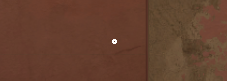
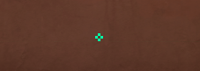
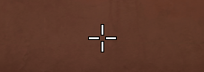
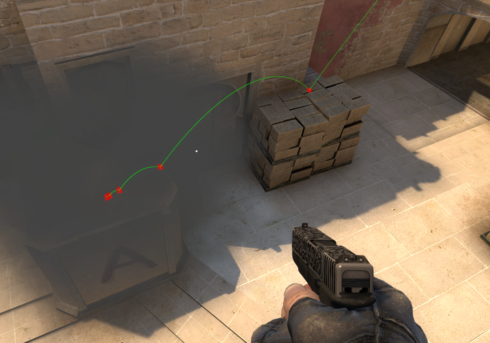
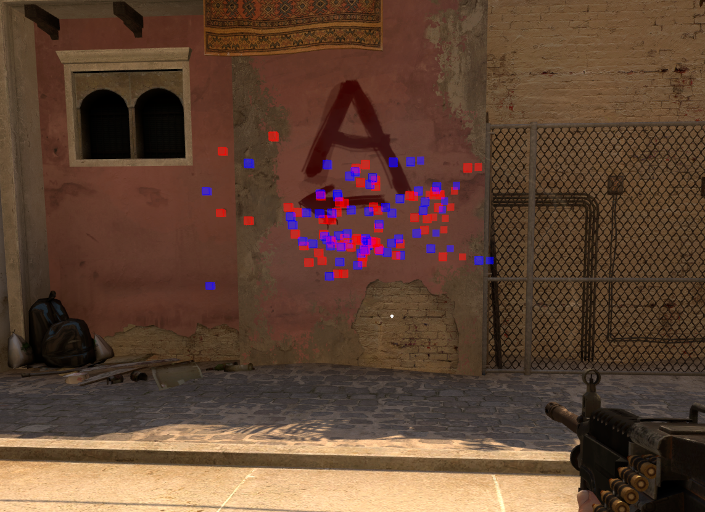
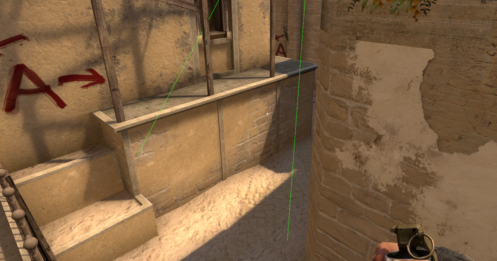

# CS:GO Config & Setup
A collection of config, settings and script files for CS:GO

### Launch Options
- Open `launch_options` and copy line
- Open CS:GO properties in Steam
- Paste in "Launch Options" input

### Install scripts
Simple batch-scripts to "install" configs by symlinking them into `path/to/csgo/cfg`

- `install` -- Symlink single .cfg file by filename
- `install_all` -- Symlink ALL .cfg files in working directory

### Configs
Run config(s) on startup by installing `autoexec`, or manually by entering `exec <config_name>` in console

- `autoexec` -- Automatically executed on startup
- `comp` -- Competetive settings (normal playing settings)
- `prac` -- Practice settings (for learning nades etc.)
- `cross` -- Crosshair settings

## Crosshairs
Some sample crosshairs. Add more by creating and installing a new .cfg-file with different settings.

#### Dot

#### Small

#### Spectator

## Practice
A collection of binds and server settings that makes it easy to practice lining up and throwing grenades, spraying etc.

#### Grenade trajectory

#### Impacts

#### Rays
